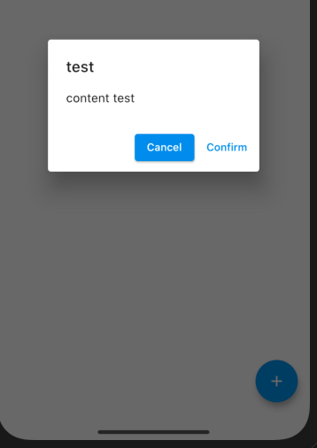
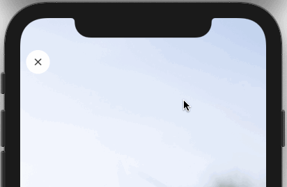

# This Effect in Flutter

The idea of this project is to show how to achieve some visual effects in Flutter (using native widgets or not).

| Effect | Description |
| ------ | ----------- |
|  | Display this bottom menu |
|  | `IconButton` with background color |
|  | Confirmation dialog |
|  | Hidding/Showing status bar (SystemUiOverlay) |
