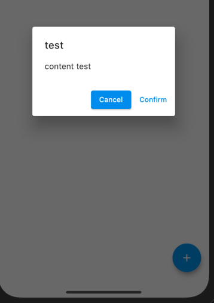

### Example:

``` dart
showDialog(
    context: context,
    builder: (BuildContext context) {
        return AlertDialog(
            title: Text('test'),
            content: Text('content test'),
            actions: [
                ElevatedButton(
                    child: Text('Cancel'),
                    onPressed: () => Navigator.pop(context)
                ),
                TextButton(
                    child: Text('Confirm'),
                    onPressed: () => onDelete(context)
                ),
            ]
        );
    }
)
```

